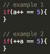

# Variables

C includes the following most common types: `char`, `int`, `long`, `double` and `float`. A `char` is always a byte but the size of the other variables is machine dependent. Due to the confusion caused by variable sizes on different machines, in our software we use the types defined in `stdint.h`. These include the following unsigned types: `uint8_t`, `uint16_t`, `uint32_t` and `uint64_t` and the following signed types: `int8_t`, `int16_t`, `int32_t` and `int64_t`, where the numbers are the number of bits the variable holds. These types allow us to have better control over the sizes of our variables. So don’t use a 64 bit variable in a for loop that loops 10 times.

Here you can see how to initialize and set variables using binary, hex and decimal. The ``//`` before text is how you make a comment in C.


You may have noticed no mention of strings or booleans, which are common types in several other languages. While a char represents a byte, it also can represent a character, hence the name char. So a string of characters is just an array of chars with a terminating character (```\0```) as the last element. ```char[] s = “Hello World”``` is a away to initialize a char array.

As for booleans we just use a char or uint8_t to represent them. 0 represents false and any other number is true. By convention we use 1 to represent true. So the statement ```5 == 5``` evaluates to 1 whereas ```5 != 5``` evaluates to 0. Here are the mathematical operators you can do in C:

> ```*``` (multiplication)  
> ```/``` (division)  
> ```+``` (addition)  
> ```-``` (subtraction)  
> ```%``` (modulus)  


Here are the comparative operators:

> ```>``` (greater than)  
> ```>=``` (greater than or equal to)  
> ```<``` (less than)  
> ```<=``` (less than or equal to)  
> ```==``` (checks equality)  
> ```!=``` (checks inequality)

There are also the following logical operators:

> ```&&``` (and) - ```a && b``` is true if and only if a and b are true  
> ```||``` (or) - ```a || b``` is true if and only if at least one of a and b are true


There are also the following short forms for incrementing or decrementing numbers.


In addition to ```a++``` and ```a--``` there is ```++a``` and ```--a``` which are indistinguishable without a context.



In *example 1*, a is used first in the ```a == 5``` check and then is incremented, whereas in *example 2*, a is first incremented and then used in the ```a == 5``` check.
