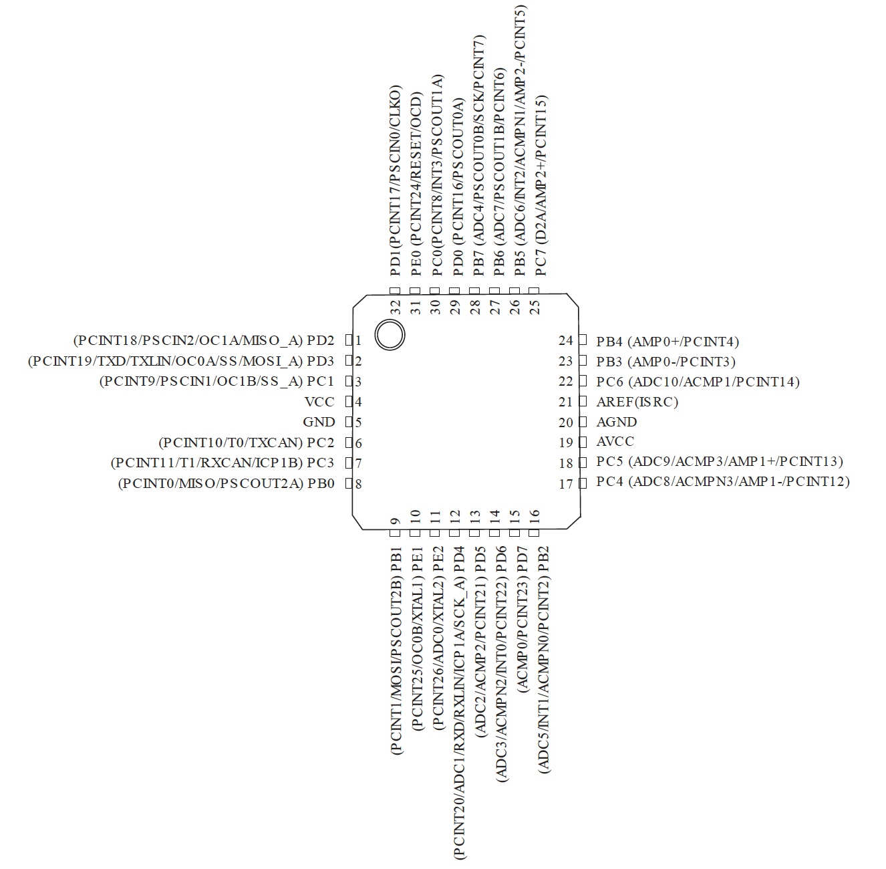
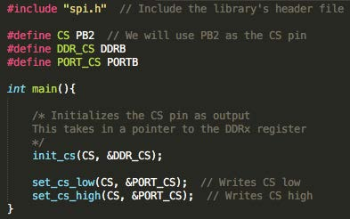
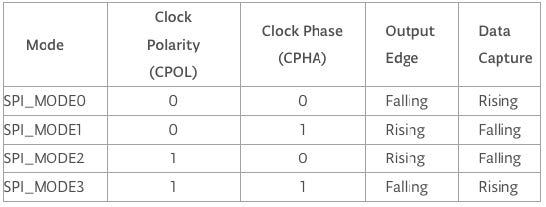

# Using our SPI Library

Here are the basic software steps to send SPI messages.

Setup:
1. Initialize SPI
2. Initialize CS as an output pin
3. Set CS high

Transmission:
1. Set CS low
2. Send SPI message
3. Set CS high


## CS Pin

On our microcontroller each IO pin has three registers that control it. We will only need to use two of them. There is the data direction register that controls if the pin is input our output and there is the port register that lets you write high or low on the pin.

Once you figure out what pin you are using for CS you can check the microcontroller’s datasheet to get the name of the pin. Figure 1 shows the pin configuration for the ATmega32m1 microcontroller.




There are four banks of ports (B, C, D and E) with eight pins on each. There are 8-bit data direction and port registers for each of the four ports. Each bit in the register is for a separate pin. The data direction register is called DDRx and the port register is just called PORTx where x is the port. So if you wanted to initialized PB6 as output the code would be the following.


The macro ```_BV(PB6)``` expands to ```1 << PB6``` and PB6 is a macro that expands to 6. Here is the code to write high or low on PB6.


In our SPI library we have functions that will do this for you. This is how you use them.




## Initialize SPI
We have a function, ```init_spi()``` that does this. It initializes SCK and MOSI as output and sets the SCK frequency to 8 MHz / 64. The 32M1’s internal clock frequency is 8 MHz.

## Sending a SPI message
SPI sends 8 bit messages. If you want to send more than a byte you can send consecutive SPI messages. This is how you do it.


## Example SPI Code


```c
/*
Example from PAY:
Say we want to use the pin labelled PB5 on the 32M1 as the CS pin for the SPI device.
It uses pin 5 on DDR B (data direction register) and Port B (output).
*/

// This would be in a header file
#define CS PB5
#define CS_PORT PORTB
#define CS_DDR DDRB


// Setup: Just do this once

// Initialize SPI
init_spi();

// Initialize CS pin as an output pin
init_cs(CS, &CS_DDR);   // pin, DDR

// Set CS pin high (disable SPI device by default)
set_cs_high(CS, &CS_PORT);


// Transmission: do this every time you want to transmit

// Start transmission: set CS pin low (enable SPI device)
set_cs_low(CS, &CS_PORT);  // pin, port

// Send and/or receive data: call send_spi() for each byte
uint8_t received1 = send_spi(0xA4); // if you want to both send and receive
uint8_t received2 = send_spi(0x00); // if you just want to receive (send 0)
send_spi(0xA4);                     // if you just want to send (ignore received)

// End transmission: set CS pin high (disable SPI device)
set_cs_high(CS, &CS_PORT);
```


This is another full SPI program to make sure SPI is running correctly on the microcontroller.


This repeatedly sends ```10101010```.

## More Clock Settings (advanced)



The two clock settings introduced here are Clock Polarity and Clock Phase. Clock Phase determines whether data is shifted in and out on the rising or falling edge of the data clock cycle. Clock Polarity determines determines whether the clock is idle when high or low.
