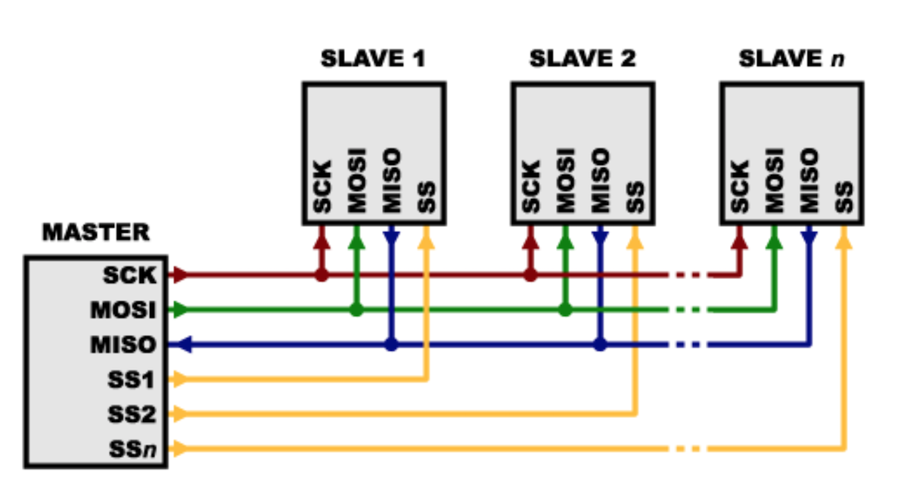

# 4. Data Transfer Protocols

## 4.1 Universal Asynchronous Receiver-Transmitter \(UART\)

## 4.2 Serial Peripheral Interface \(SPI\)

### 4.2.1 Background
SPI is a synchronous serial communication protocol used to communicate between devices. SPI uses a master-slave architecture, with a single master device initiating the communication frame, and operates in full-duplex mode (data can be sent in both directions).

To achieve this, SPI typically uses four wires to communicate, which are referred to as the _SPI bus_. Three lines, `SCK`, `MOSI` and `MISO`, are shared between _all devices_ on a SPI bus. The fourth line, `CS`, is _unique to every slave device_, and are all connected to the master device. To initiate communication, the master device writes `CS` LOW (chip select LOW) to a particular device, and begins clocking out a square wave on `SCK` \(source clock\). This square wave synchronizes the two devices, and data is then transferred on either the rising or falling edge. `MOSI` \(master out slave in\) and `MISO` \(master in slave out\) serve as the data transmission lines.

In case all this is new to you \(which it very likely is\) in digital systems data is typically transferred in the form of `1`'s and `0`'s. In hardware, `1`'s and `0`'s are represented as high and low voltages. Our satellite uses 3.3V, so a `1` corresponds to ~3.3V on a particular line, and a `0` corresponds to ~0V.

\

## 4.3 Inter-Integrated Circuit \(I2C\)

## 4.4 Controller Area Network \(CAN\)
