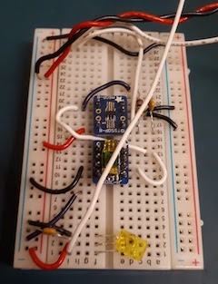
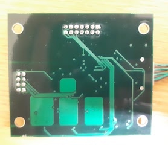

# Circuits

Here are the different base platforms for building circuits.

## Breadboard
* Used to quickly build and change circuits for fast prototyping
* Has holes to insert through-hole components and wires
* Components and wires can be moved easily, but can also be knocked loose easily
* Uses through hole (TH) components
* Particular sets of holes are connected under the board:
  * Each long rail of holes is connected together (there are two rails on each side). It is general convention to use the red rails for power and the blue rails for ground.
  * Each row of 5 holes in the main part of the board is connected together. These are used to connect components together.
  * If you forget which holes are connected, follow the lines and notice the breaks in the lines
(add diagram/photo with lines indicating the connected sets of holes)

## Printed Circuit Board (PCB)
* Used to create final circuits or major prototype versions of a circuit
* Getting a functional PCB requires several steps:
  * Design it using CAD software (we use one called KiCad) - create a schematic of the component connections, then create a PCB layout of those components
  * Send the design to a manufacturer, who prints the board with just the traces (connections/wires)
  * Order all of the components
  * After receiving the board from the manufacturer, solder the components onto it
  * The ordering and soldering process alone usually takes at least a week, which is why PCBs are not used for fast prototyping
* A PCB’s connections can’t be changed after it is ordered and printed (with some exceptions, but it is very difficult and unreliable)
* Generally uses surface mount (SMD/SMT) components, which are much smaller than through hole

## Protoboard
* Has connected tracks like a breadboard, but through hole components are soldered and are more likely to stay on the board

