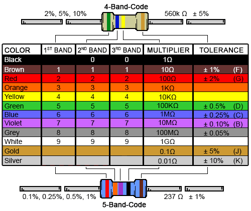

# Components

Here are some of the common electrical components used.

## Resistor

Resists the flow of electrical current.

| Through Hole | Surface Mount |
| :-: | :-: |
|  |  |

Through hole resistors use colour-coded bands to indicate their value.

## Capacitor

Stores energy in the form of electrical energy. It can store charge and release it when necessary, so it is often used as a *decoupling capacitor* to smooth out fluctuations in a voltage.

## Diode

Only allows current to flow in one direction. If the current flows into the diode in the proper direction, this is called forward biased and ideally behaves as a short circuit. If the current flows into the diode in the opposite direction, this is called reversed biased and ideally behaves as an open circuit.

An LED (light emitting diode) also produces light when forward biased.

## ADC (Analog to Digital Converter)

Converts an analog input signal within a particular range to a digital signal with a specific number of bits.

We measure fluorescence and optical density from the samples using sensors whose output goes through an amplifier chain to produce a voltage. This voltage is an analog signal (can be one of an infinite number of values in a range), but we need to convert it to a digital (discrete) format that can be used by the 32M1.

## Header

Headers are used on PCBs to provide an easy interface to connect wires between boards or with a laptop interface.
