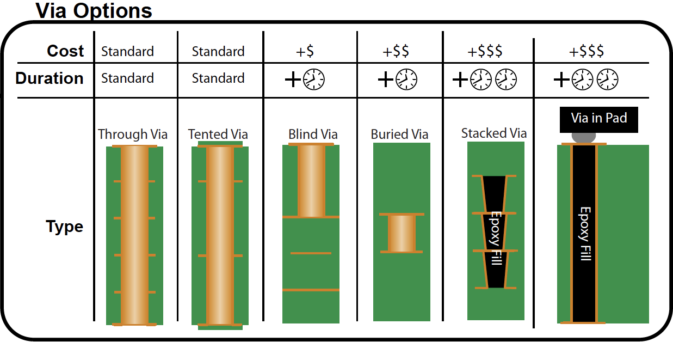

# PCB Design

A PCB (Printed Circuit Board) is a circuit board that is designed and manufactured using CAD (Computer Aided Design) software, also called EDA (Electronic Design Automation) software.

Getting a functional PCB requires several steps:
* Design the board's connections and layout using CAD software
* Send the design to a manufacturer, who manufactures the board with just the traces (electrical wires)
* Order all of the components
* Receive the board from the manufacturer
* Purchase the necessary components
* Solder the components onto the board.

This process usually takes at least a month, which is why PCBs are not used for fast prototyping.

## Software
We use two different pieces of CAD software.

### KiCad ([website](http://kicad-pcb.org/))
- Free and open source
- Easier to learn
- Available for Windows, Mac, and Linux

### Altium Designer ([website](https://www.altium.com/altium-designer/))
- Paid, but UTAT is sponsored by Altium and gets free licenses
- More difficult to learn
- Only available for Windows

## Design Process

Designing a PCB is generally separated into two main steps.

### Schematic

The schematic specifies all the components and how they are logically connected to each other to create circuits (which pins are connected). This does not have anything to do with the physical arrangement of components.

### PCB Layout

The PCB Layout involves taking the schematic and physically laying out the components and connections as they will be located on the PCB. After placing the components, you route the wires (also called traces or tracks) so they do not cross one another. Altium Designer has an autorouter that can automate this process.

## Layout

The simplest PCB uses 1 layer and places all component on one side, but multiple layers can be used. Some PCBs have 2 layers, where you can put components and traces on the other side as well. Some have 4 layers, such as the payload sensor PCB which has dedicated layers for power and ground connections to minimize electrical noise. In any case, you can only put components on a maximum of 2 layers (top and bottom). Other layers are useful for dedicated power/ground planes or to route traces that are impossible to put on one layer without crossing.

### Vias

A via is a hole that connects a trace on one layer to another layer. They are useful for routing traces that cannot be routed on a single layer without crossing other traces. For example, you can start a trace on the top layer, place a via to the bottom layer, route it along the bottom layer, then place another via bringing it back to the top layer.

## Components

### Schematic Components

A schematic component describes a component's type and pins.

### Footprints

A footprint describes a component's physical size and shape.
