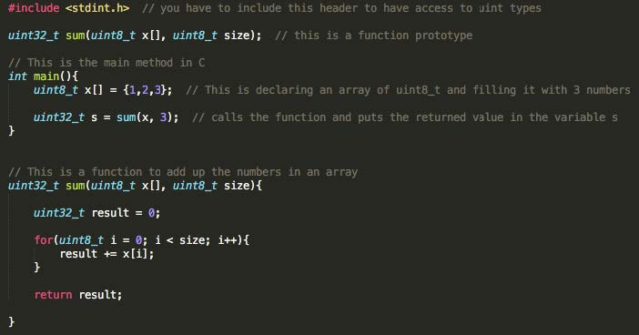
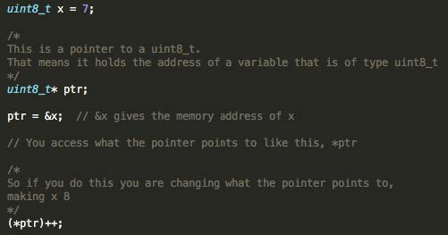
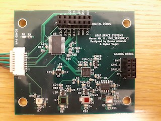
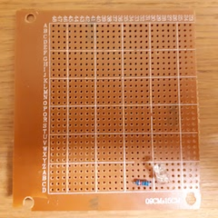
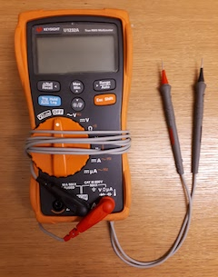
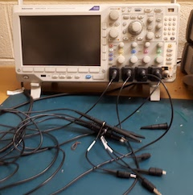
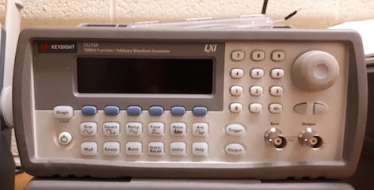
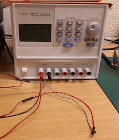
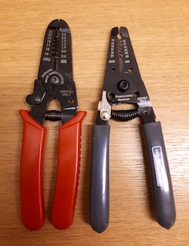
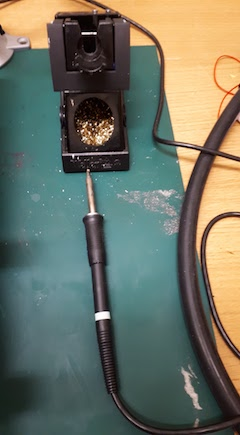

# Instrumentation Introduction
This document is meant to provide a preliminary overview of topics which we feel are useful to a new member joining the Instrumentation subsystem. The topics covered include SPI (Serial Peripheral Interface), reading datasheets, C programming, and hardware in the MP099 lab.


# C Programming

In this document, we will provide a brief overview of the basics of the C programming language, putting emphasis on the most relevant areas. I will assume some previous programming experience and for certain topics universal to all programming language I will only provide an example of the C syntax with a brief explanation. In addition to this document I would recommend **“The C Programming Language”** by Brian Kernighan and Dennis Ritchie. **You can find a pdf of this book on the Google Drive in /Instrumentation/Literature.** This book describes all the features of C in great detail and is suitable for all levels of programming experience.


## So, what makes C different than other programming languages?
Well, one thing is that it’s not an object oriented programming language like Java or C++ or a whole lot of other programming languages. In addition to that, C is considered a relatively low level programming language since most C operations can be moderately easily translated into assembly. Because of this, C is a great choice for developing software that interfaces directly with hardware. Another unique part of C is pointers and dynamic memory allocation. C allows its programmers to have a generous amount of control over the computer’s memory.

Now, let’s get into C.

## Variables in C
C includes the following most common types: char, int, long, double and float. A char is always a byte but the size of the other variables is machine dependent. Due to the confusion caused by variable sizes on different machines, in our software we use the types defined in stdint.h. These include the following unsigned types: uint8_t, uint16_t, uint32_t and uint64_t and the following signed types int8_t, int16_t, int32_t and int64_t, where the numbers are the number of bits the variable holds. These types allow us to have better control over the sizes of our variables. So don’t use a 64 bit variable in a for loop that loops 10 times.

Here you can see how to initialize and set variables using binary, hex and decimal. The ``//`` before text is how you make a comment in C.


You may have noticed no mention of strings or booleans, which are common types in several other languages. While a char represents a byte, it also can represent a character, hence the name char. So a string of characters is just an array of chars with a terminating character (```\0```) as the last element. ```char[] s = “Hello World”``` is a away to initialize a char array.

As for booleans we just use a char or uint8_t to represent them. 0 represents false and any other number is true. By convention we use 1 to represent true. So the statement ```5 == 5``` evaluates to 1 whereas ```5 != 5``` evaluates to 0. Here are the mathematical operators you can do in C:

> \* (multiplication)  
> / (division)  
> + (addition)  
> - (subtraction)  
> % (modulus)  

Here are the comparative operators:

> ```>``` (greater than)  
> ```>=``` (greater than or equal to)  
> ```<``` (less than)  
> ```<=``` (less than or equal to)  
> ```==``` (checks equality)  
> ```!=``` (checks inequality)

There are also the following logical operators:

> ```&&``` (and) - ```a && b``` is true if and only if a and b are true  
> ```||``` (or) - ```a || b``` is true if and only if at least one of a and b are true


There are also the following short forms for incrementing or decrementing numbers.


In addition to ```a++``` and ```a--``` there is ```++a``` and ```--a``` which are indistinguishable without a context.


In *example 1*, a is used first in the ```a == 5``` check and then is incremented, whereas in *example 2*, a is first incremented and then used in the ```a == 5``` check.

## Bitwise Operators
These operators directly manipulate the bits in numbers. A lot of our software is manipulating 8 bit registers on our microcontroller so bitwise operators are very common in our software. The first two are very similar to ```&&``` and ```||``` mentioned above. They are the “and” and “or” bitwise operators, represented by ```&``` and ```|```. They both combine two numbers into one. First I will explain the “and” operator.

This is how it is used.


It works like this. We’ll move from right to left comparing the bits. If both the bits are 1 the result
will have a 1 in that location, otherwise it will have a 0. Just like ```&&``` it needs two 1’s to get a 1.

```
10110001
00101110
--------
00100000
```

There is only a 1 in the 6th bit position because that is the only position where there is a 1 in both the numbers.

The “or” operator works exactly the same except if at least one of the bits is a 1 the result will have a 1 in that position.


There is another operator really similar to those two. It’s called the XOR (exclusive or) operator
and is represented as ```^```. If one and only one of the bits is a 1 then the result will have a 1 in that
position.


All these operators can also be used as ```&=```, ```|=``` and ```^=```.

The next group of bitwise operators is bit shifts. There is left (```<<```) and right (```>>```) bit shifts. They do what the name suggests, shift the bits in a number.


The bits are shifted to the left and 0’s are shifted in. You might think x is now ```0b111111110000```
but that is incorrect because that is no longer an 8 bit number. It is actually ```0b11111111```. With bit
shifts you have to consider the size of the variable because if you shift a number to the left past
its limit those bits will be cut off.


When we shift this number by four, four of the leading zeros are being cut off so we end up with ```0b0000111111110000```, or more nicely ```0x0FF0```.

The right bit shift does the exact same thing except in the opposite direction. No matter the size
of the variable the bits will be cut off.


In this case the bits are shifted out of the variable to the right and 0’s are shifting into the variable on the left. Here we will end up with x as ```0b00001111```.

There is one final bitwise operator called the not or compliment operator. It flips all the bits in the number so 1’s become 0’s and vice-versa. It is represented by the ```~``` symbol.

**Example 1:**


In this example x becomes 0b01011100.

**Example 2:**


In this example x becomes ```0b1111111100001111```. Don’t forget about those leading zeroes.

## Applications of Bitwise Operators
I mentioned that bitwise operators are very common in our software so now I will show you the most common uses in our software.

Very frequently we have to set bits in an 8 bit number to change settings in our microcontroller. We use bitwise operators to change certain bits while not affecting others.

This is how to write a certain bit to 1


Now the value of x is ```0b00100000```.

And you can set a certain bit to 0 with the following,


Now the value of x is 0b11011111

You can also switch the value of a bit with the following:


## If statements in C
If statements in C look very similar to if statements in java


## Switch statement
Switch statements are used quite often in our software.


## While Loop


## For Loop


There are two useful commands for conditional statements and loops that are worth mentioning.
These commands exist in most other programming languages.

>**break** - exits the current statement or loop    
>**continue** - skips the current iteration of the loop and continues with the next

## Functions

In C functions are very similar to functions/methods in other programming languages. We’ll look at the following code to learn how to do functions in C and see what a C file should look like.



First I included ```stdint.h```. I will go into header files a bit more later.

In C the main method returns an int. By default it returns 0. All C projects must contain one and only one main method.

The function sum takes in a ```uint8_t``` array and it’s size and returns a ```uint32_t```. In C you have to always pass the size of an array with the array.

The only difference with functions in C is that for the function to be recognized throughout the file it needs to have a function prototype as show above.

## Header Files
A header file that we have already seen is ```stdint.h```. The purpose of header files is to have definitions and declarations that can be shared amongst multiple files by including the header. By putting function prototypes in a header file and including it, you can call those functions in other files. For non-library header files make sure to include them using ```#include “file_name.h”``` whereas library headers are included with ```<file_name.h>```. Header files can also include other header files.

You can also put define and typedef statements in header flies. These statements that I will describe shortly, can also be put in the source file but for better organization tend to be put in a header file.


The preprocessor will replace text in the source code based on the define statements. So every occurrence of foo in the source code will be replaced with bar.

The ```typedef``` statement shown above lets you use “boolean” as a type. Now the following is a valid statement.


## Pointers
A pointer is a type of variable whose value is the memory address of another variable. This is how you declare and use a pointer.




## Structs
Structs are a useful way of bunching multiple variables together. This is probably the closet C gets to objects. We tend to declare our structs in a header file using typedef for easier use.


I think this should be enough of a crash course on C to get you writing programs. There are more details on pointers and structs that I have left out. I would suggest the C book I mentioned earlier to learn more about those topics.


# SPI (Serial Peripheral Interface)

In this section, we will describe the SPI protocol and how to use our library with the ATmega32m1, the main microcontroller used on the Heron Mk. II cube-satellite.

## What is SPI?
SPI is a communication protocol used to communicate between microcontrollers and peripheral devices, such as sensors. Put simply, it’s a system that allows us to send a byte to some device and receive a byte in return.

SPI uses what’s called a Master-Slave architecture. In this system there is one master device that communicates to multiple slave devices. In our system the master device is our microcontroller and the slave devices are mostly sensors. The master can only communicate with one slave device at a time and the slaves cannot communicate with each other.

## SPI Bus
SPI uses four lines, which make up what we call the SPI bus. Three of these lines (SCK, MOSI, MISO) are shared amongst the slave devices. Whereas the final line (CS) must be unique to each slave device.  SPI is a synchronous communication protocol, meaning data is sent and received at the same time. This means that two of the four lines (MOSI, MISO) are for data, and one of the lines (SCK) is for timing. One of the data lines is for master to slave and the other is for slave to master. All of this will make more sense shortly. The four lines are shown in the figure below. They'll be explained in more detail shortly.


### SCK (Source Clock)
The clock keeps both the data lines in sync. The clock is an oscillating signal produced by the master device that tells the receiving device when to read the data. Depending on the device properties, data is either sent/received on the rising/falling edge of SCK. I'll touch on this in more detail shortly. This line is shared by all slave devices.

### MOSI (Master Out Slave In)
The name pretty much explains this line. This is the line where data is sent from the master device to the slave device. This line is shared by all slave devices.

### MISO (Master In Slave Out)
On this line the data is being sent out of the slave device received by master. This line is shared by all slave devices.

### SS/CS (Slave Select / Chip Select)
This line is referred to as SS and CS interchangeably. CS is active low, which means the slave device is active when CS is written low. Only one CS can be low at a time or there will be conflicts on the SPI bus resulting in garbage data. We use a pull-up resistor on the CS pin to set a default value.

A pull-up resistor is a large resistor (typically 10K) which bridges between VCC (3V3 in our case) and another pin. When no load is applied to the pin, no current flows through the resistor. This allows us to hold CS at a known (3V3) state when the CS pin isn't being driven by other circuitry. Then, we can drive another pin on the CS line low (GND) to select the device. Current will flow through the resistor and drop 3V3 across it.

Hopefully the diagram above now makes sense.
This is what a SPI transfer should look like:


I took this image from online but SPI transfers look very similar on our equipment.

I’ll pose the following question:

> *Which lines are which?*

|

You can’t really distinguish between MISO and MOSI in this picture but just pick one to be MOSI and the other to be MISO. What is being sent and received? The answer is given below.

> **Answer:**
>
> 1. The **yellow line is CS**. This is because it is being lowered before and raised after the SPI transfer is complete.
>
> 2. The **green line is SCK**. It oscillates 8 times for each byte sent.
>
> 3. The **pink and blue are MOSI and MISO**. The blue line has ```0x00``` and ```0x00``` and the pink line has ```0b10010101``` and ```0b01010101```.

## Using our SPI Library
Here are the basic software steps to send SPI messages:

1. Initialize CS as an output pin
2. Set CS high
3. Initialize SPI
4. Send SPI message
5. Set CS low
6. Send message
7. Set CS high


### Initializing CS as an output pin and writing CS high or low
On our microcontroller each IO pin has three registers that control it. We will only need to use two of them. There is the data direction register that controls if the pin is input our output and there is the port register that lets you write high or low on the pin.

Once you figure out what pin you are using for CS you can check the microcontroller’s datasheet to get the name of the pin. Figure 1 shows the pin configuration for the ATmega32m1 microcontroller.


There are four banks of ports (B, C, D and E) with eight pins on each. There are 8-bit data direction and port registers for each of the four ports. Each bit in the register is for a separate pin. The data direction register is called DDRx and the port register is just called PORTx where x is the port. So if you wanted to initialized PB6 as output the code would be the following.


The macro ```_BV(PB6)``` expands to ```1 << PB6``` and PB6 is a macro that expands to 6. Here is the code to write high or low on PB6.


In our SPI library we have functions that will do this for you. This is how you use them.


### Initialize SPI
We have a function, ```init_spi()``` that does this. It initializes SCK and MOSI as output and sets the SCK frequency to 8 MHz / 64. 8 MHz is the frequency of the 32m1’s internal clock.

### Sending a SPI message
SPI sends 8 bit messages. If you want to send more than a byte you can send consecutive SPI messages. This is how you do it.


### Example SPI Code
This a full SPI program that I used to make sure SPI was running correctly on the microcontroller.


This repeatedly sends ```10101010```.

### More Clock Settings
As I touched on earlier in this document, there are more clock settings.


The two clock settings introduced here are Clock Polarity and Clock Phase. Clock Phase determines whether data is shifted in and out on the rising or falling edge of the data clock cycle. Clock Polarity determines determines whether the clock is idle when high or low.

This is the end of this SPI tutorial. Hopefully you you are now a SPI expert.

# Lab Equipment (WIP)

Here is some equipment you will see and use in the lab (MP 099). We will demonstrate how to use the equipment in-person.

## Circuit Platforms
These are some of the different base platforms for building circuits.

### Breadboard
* Used to quickly build and change circuits for fast prototyping
* Has holes to insert through-hole components and wires
* Components and wires can be moved easily, but can also be knocked loose easily
* Uses through hole (TH) components
* Connections:
  * Particular sets of holes are connected under the board
  * Each long rail of holes is connected together (there are two rails on each side). It is general convention to use the red rails for power and the blue rails for ground.
  * Each row of 5 holes in the main part of the board is connected together. These are used to connect components together.
  * If you forget which holes are connected, follow the lines and notice the breaks in the lines
(add diagram/photo with lines indicating the connected sets of holes)


### Printed Circuit Board (PCB)
* Used to create final circuits or major prototype versions of a circuit
* Getting a functional PCB requires several steps:
  * Design it using CAD software (we use one called KiCad) - create a schematic of the component connections, then create a PCB layout of those components
  * Send the design to a manufacturer, who prints the board with just the traces (connections/wires)
  * Order all of the components
  * After receiving the board from the manufacturer, solder the components onto it
  * The ordering and soldering process alone usually takes at least a week, which is why PCBs are not used for fast prototyping
* A PCB’s connections can’t be changed after it is ordered and printed (with some exceptions, you can ask for some good stories)
* Generally uses surface mount (SMD/SMT) components, which are much smaller than through hole




### Protoboard
* Somewhat of a hybrid between a breadboard and PCB
* Has connected tracks like a breadboard, but components need to be soldered and are more likely to stay on the board
* Uses through hole components




## Tools
These are some of the tools you will use to build, test, and debug circuits.

### Multimeter
Used to measure voltage, current, resistance, and connected points in parts of a circuit.

* **Voltage** - must be **measured across a component** because voltage is the relative energy between two points
* **Current** - must be **measured through a wire**; you have to break (disconnect) the circuit at the point you want to measure, then insert the multimeter as a component in series
* **Resistance** - must be **measured across a component** because resistance is measured between two points
* **Short circuit mode** - used to determine if there is a short circuit **between two points** in the circuit (a direct connection through wires with no components in between)
  * After assembling a circuit, can check that you have made the intended connections
  * Can check that you have not made accidental connections that change your circuit. An unintentional short circuit can change the circuit's behaviour and/or produce a high current that can damage components.



### Oscilloscope
* Used to measure waveforms (signals) over time in a circuit
* This is useful for viewing the raw signal data in a wire, such as a sensor’s output or communication lines



### Function Generator
* Used to generate an AC (alternating current) signal with a specific voltage and waveform



### Power Supply
* Used to generate DC (direct current) power with a specific voltage or current



### Wire Cutters/Wire Strippers
* **Wire cutter** - to cut specific lengths of wire to use on breadboards
* **Wire stripper** - to remove some of the insulation on the end of a wire so it can be connected to a breadboard



### Soldering Iron
* Used to form strong electrical connections between components on PCBs or protoboards




## Microcontrollers
A microcontroller is a processing unit, like the brain of a circuit.

### AVR/ATmega32M1
Our subsystem's components will be controlled by the ATmega32M1 microcontroller on the satellite, part of the AVR family of microcontrollers. It is programmed in the C language, and you will need to install the AVR software to compile and upload code to it (which we will help you to get set up).


### Arduino
Arduino is an open-source platform of microcontrollers, which we sometimes use to test components quickly. Since Arduino has more built-in code libraries, it is faster to write and upload code to test individual components than using the AVR microcontroller. Arduino is programmed using a slightly modified version of the C++ language.


# Uploading Code (AVR)
Here is how to upload your code to the AVR ATmega32M1 microcontroller.

1. Follow the instructions at https://github.com/HeronMkII/coms-board to download and install the AVR software.

2. Download the CoolTerm application from http://freeware.the-meiers.org. This will be used to view transmissions from UART, a communication protocol to transmit log messages (from the print() function) from the board to the computer.

3. Get the programmer hardware device. Connect the 6-pin connector to the "Programming" header on the PCB, which is used to upload code. Connect the "RX" pin on the programmer to the "MOSI_A" pin on the PCB. RX refers to the "receive" pin, while MOSI_A refers to the "alternative" MOSI line, used for UART which is separate from SPI.

4. Turn on the power supply, set the output to 3.3V, and connect the power and ground lines to the "3V3" and "GND" header pins on the PCB.

5. See the instructions at https://github.com/HeronMkII/coms-board for finding the correct USB port and modifying the makefile (it might already be the correct one).

6. Open CoolTerm and modify the options to set the correct port (see https://github.com/HeronMkII/coms-board; the port for UART is the **opposite** of the port for uploading code). Click Connect.

7. Navigate to the folder for the local copy of the Git repository on your computer. Run ```make upload``` to compile the program and upload it to the board. Fix any compile-time errors if they occur.


# Reading Datasheets
One recurring area of confusion which arises within Instrumentation is how to read the datasheet for a component. The datasheet for a component is an important

## Reading Datasheets for Electrical Engineers


## Reading Datasheets for Computer Scientists
